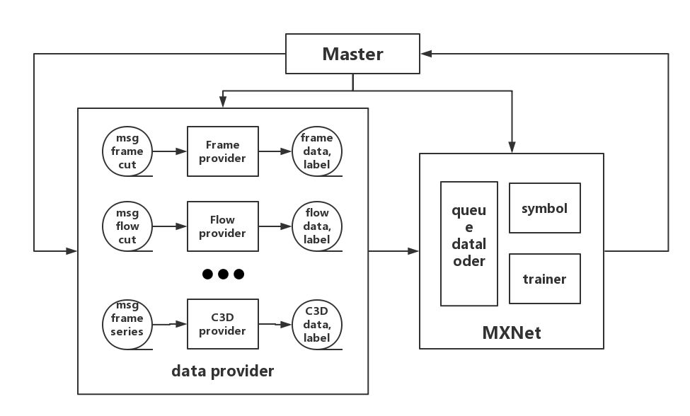

# MXNet_Video_Trainer
simple training system for video training 
## 模型框图

包含 主控模块(Master)，数据提供模块(data provider) 和 MXNet 训练模块 以及若干个消息队列。
### 主控模块：
主控模块负责后面两个模块的创建和销毁，同时负责向input的消息队列里面传入截帧，计算光流和截取一系列帧所需要的信息，同时收取训练结束的反馈。
### 数据提供模块：
前面接一个输入参数的消息队列，并完成对应的截帧，计算光流或者是截取一系列帧后，将数据和label写入训练数据的消息队列
### MXNet 训练模块：
基于MXNet的DataIter ，实现一个输入一系列消息队列的数据输入layer。
定义对应的symbol文件，设置超参，启动训练
## 实现：
1. 单机实现。
2. 队列使用python多线程队列，
3. 截帧，计算光流等用ffmpeg 直接搞定，
4. 需要开发一个读取特定队列的mxnet dataloader
5. 联机调试进行训练

## 多线程队列测试通过
调用 `python train.py` 查看测试效果
`config.py` 中 `config.RUNTIMECONFIG.num_provider_thread = 10` 可以设置 `providier` 的线程数目

